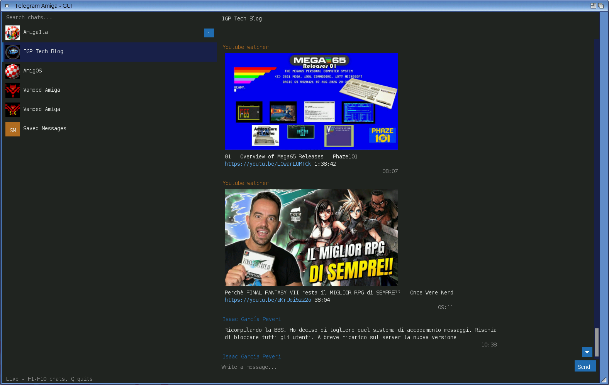

<!--
Copyright (c) 2026 Michele Dipace <michele.dipace@kaffeine.net>
SPDX-License-Identifier: MIT
-->

# Unofficial Telegram Amiga

A from-scratch, native **MTProto Telegram client** for Amiga-family systems:
log in with a normal Telegram account, list your chats and exchange messages.
**Zero external dependencies**: no MUI, no ixemul, no AmiSSL. All the
cryptography (RSA, Diffie-Hellman, SRP/2FA, AES, SHA) is built in.

It is an unofficial client: it uses the Telegram API and is part of the
Telegram ecosystem, but it is not made by Telegram.

Two front-ends share one engine:

- **TelegramAmiga** is a native Intuition/GadTools GUI: chat list with real
  avatars and persistent unread badges, conversation view, scrollbars (wheel,
  knob drag, arrow keys, pixel scroll), scroll-to-top history paging,
  click-to-compose with multi-line wrap, online chat search, drag-and-drop
  reorder and remove, live receive, "&lt;name&gt; is typing", read receipts,
  file sharing and a pinned Saved Messages chat. A double-click starts it with
  no flashing console and no launcher script. Drawn by the client itself on a
  RastPort.
- **TelegramAmiga-TUI** is the text/console client, at home on a 68030 with a
  serial console: same engine, launched from the second icon.



Status: **alpha 0.0.95** - everyday direct-message and group chat works on all
six platforms below. 0.0.95 is the speed release. Downloads and uploads keep
several parts in flight instead of waiting for each one, and AES and SHA-256
work on whole words: on a Vampire downloads went from 97 to 199 KB/s and
uploads from 112 to 213 KB/s, and a real MorphOS machine takes in a 4 MB file
at up to 1.6 MB/s. A first start shows its window before the key exchange
with the datacenter of the pictures, and two-step verification now completes
on a stock A1200. A Full-size photos setting opens the largest copy of a
picture in the viewer, and Save photo as... then writes the original. The
text client writes messages up to Telegram's 4096 characters and keeps a
pasted text of several lines in one message; long captions no longer fail,
and long messages that arrive are no longer cut inside a letter.

It retains 0.0.94's sixth platform, its icons and its fixes for FAT volumes,
0.0.93's emoji panel, attachment chooser and working logins, 0.0.92's link
previews, video frames and attachment labels, 0.0.9's photo pipeline, and the
messaging, file sharing, replies, editing, read receipts and avatars delivered
by earlier releases.

Development on `main` now heads for the 0.1 beta, through the slots the
roadmap keeps for field reports and for the features waiting there. Work there
is unreleased and remains subject to real-system validation on all six
platforms; see [ROADMAP.md](ROADMAP.md).

License: MIT. A non-commercial community project, a gift to the Amiga
community. Development diary:
<https://androidlab.it/en/telegram-amiga-mtproto-client-development-diary/>

## Platforms & releases

Each package bundles both clients, icons, a public `telegram-api.txt` and
per-architecture IT/EN manuals, and **no private files**.

| Platform | CPU | Release |
|---|---|---|
| AmigaOS 3.x (68020+) | m68k | [os3-alpha-0.0.95](https://github.com/kaffeine1/telegram-amiga/releases/tag/os3-alpha-0.0.95) |
| AmigaOS 4.x | PPC | [os4-alpha-0.0.95](https://github.com/kaffeine1/telegram-amiga/releases/tag/os4-alpha-0.0.95) |
| MorphOS | PPC | [morphos-alpha-0.0.95](https://github.com/kaffeine1/telegram-amiga/releases/tag/morphos-alpha-0.0.95) |
| AROS i386 (ABIv0) | x86 | [aros-i386-alpha-0.0.95](https://github.com/kaffeine1/telegram-amiga/releases/tag/aros-i386-alpha-0.0.95) |
| AROS x86_64 | x86-64 | [aros-x86_64-alpha-0.0.95](https://github.com/kaffeine1/telegram-amiga/releases/tag/aros-x86_64-alpha-0.0.95) |
| AROS aarch64 (Raspberry Pi) | ARM64 | [aros-aarch64-alpha-0.0.95](https://github.com/kaffeine1/telegram-amiga/releases/tag/aros-aarch64-alpha-0.0.95) |

All releases: <https://github.com/kaffeine1/telegram-amiga/releases>.
Full history in [CHANGELOG.md](CHANGELOG.md) (also bundled in every package
as `CHANGELOG.txt`).

AmigaOS 3.x is a native clib2 build (no ixemul, no AmiSSL) and needs a 68020 or
better. AROS x86_64 targets trunk-SDK-matched systems (AROS One v0.38 pairs a
different kickstart and will not run it); AROS i386 ABIv0 is the broadest AROS
build. AROS aarch64 (ABIv1) runs on the native AROS image for the Raspberry Pi
4, 400 and 5, from the image of 2026-08-22 on.

## Quick start

1. Download your platform's package and copy the drawer to a **writable**
   volume (e.g. `Work:`): it writes its files next to itself, so not the CD.
2. Double-click **TelegramAmiga**, which opens the GUI directly with no
   flashing console window, or **TelegramAmiga-TUI** for the console client.
3. First run signs you in: phone number → login code → optional 2FA password. A
   `telegram-auth.bin` session is saved; later runs go straight to your chats.

> **2FA on a slow 68k:** checking a Two-Step Verification password takes a
> PBKDF2 key derivation (100000 rounds of SHA-512): under a minute on a Vampire,
> about half an hour on a stock 14 MHz 68020. Up to 0.0.94 Telegram dropped the
> login before a slow machine was done. From 0.0.95 the client does that work
> with the connection closed, then connects again for a fresh challenge and
> finishes: a real login went through on a stock A1200 in 35 minutes. Start it
> and let the machine work; there is no need to turn Two-Step Verification off.

Full IT/EN instructions are inside each package.

## What works

- MTProto auth-key creation, phone/code login wizard, 2FA, saved session.
- Chat list (users, basic groups, channels/supergroups): the full list is
  fetched once on first login, then your curation wins: drag-reorder, remove
  (menu / Del / right-Amiga+R), online search to add, persistent unread badges.
- Reading history with scroll-to-top paging (load older on demand) and sending
  long, multi-line text where the account has permission.
- **File sharing**: send and download big files (up to 125 MiB on 68k,
  250 MiB elsewhere; live %, retry, cancellable), plus a pinned
  **Saved Messages** chat as a cloud transfer drawer (fully editable).
- Message **edit & delete** (right-click), replies on double-click, live
  updates for messages edited elsewhere, clipboard **Copy/Cut/Paste** with
  text selection (mouse or Shift+arrows), @username autocomplete.
- Real **profile-picture avatars** (blurred previews instantly, crisp on open).
- **0.0.9 photo support**: inline photos with instant blurred previews, an
  on-disk decoded-pixel cache, a larger click-to-open viewer and an optional
  text-only mode for slower machines; send JPEGs as Telegram photos, save
  received photos to a chosen path, forward messages and find hidden chats in
  local search.
- Native GUI scrolling (wheel / scrollbar / arrows / pixel), remembered window
  size and position, optional own screen, Iconify to a Workbench AppIcon, dark
  theme, script-free flashless Workbench launch.
- Live receive, **"&lt;name&gt; is typing…"**, **read receipts (v / vv)**,
  message styling/entities, reply quotes, cross-chat notifications.
- `gzip_packed` responses decoded in-tree (embedded `puff`, no zlib needed).

## Not yet

Reactions, contact management, albums and media playback, and files served by
Telegram's CDN (some big public-channel downloads). The aim is a dependable
text-and-files client first; richer media comes later only where the platform
makes it realistic.

## Privacy & security

Never publish these (or screenshots/logs that reveal them):

```
telegram-auth.bin   phone-code-hash.txt   telegram-password.txt
telegram-peers.txt  telegram-seed.bin     telegram-token.txt
```

`telegram-auth.bin` is your logged-in Telegram session: anyone who gets it can
access your account. If it leaks, treat the account as compromised.

On targets without a system CSPRNG/TLS, the crypto secrets come from an in-tree
DRBG seeded from local entropy (timer jitter, keystrokes, a persisted
`telegram-seed.bin`). A first login in a fresh emulator/VM is the weakest
moment: prefer real hardware, or an AmiSSL/OpenSSL target, if your threat model
needs it.

## Build (developers)

Six lanes (see the `Makefile.*` files and `docs/`): AmigaOS 3.x (m68k clib2),
AmigaOS 4 (PPC), MorphOS (PPC), AROS i386, AROS x86_64, AROS aarch64 (Raspberry
Pi, built on a Linux host with the AROS crosstools). Host smoke test:

```sh
make -f Makefile.aros clean all ENABLE_GZIP=0 ENABLE_GZIP_PUFF=1
./build/TelegramAmiga --mtproto-self-test-fast
```

A token-based Bot API mode remains in the tree for diagnostics and TLS/HTTP
validation; it is no longer the product direction.

## Notes

The icon is our own design. Carlo Spadoni optimised it for each system, put
it on a standard drawer for the drawer icon, and let me ship his versions with
the program. His files as delivered are in `assets/icons/carlo-spadoni/`;
`scripts/build-icons.sh` turns them into one launcher set per platform.

Developed with the help of LLM agents used as engineering tools (analysis,
implementation, packaging, docs, test prep). Local diaries, transcripts and
secrets stay out of Git.

Useful bug reports: platform + version, real/emulated, CPU, TCP/IP stack, and
what failed, with secrets removed. Never post tokens, auth files, phone numbers,
login codes, 2FA passwords or private message text.
